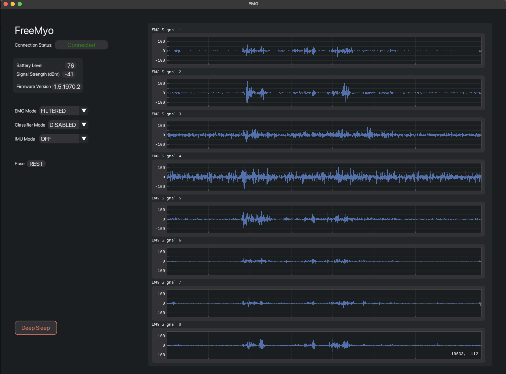

# FreeMyo.py
BLE Bleak-based Async Python interface to the Myo Armband that doesn't require a dongle or the MyoConnect software.  This has been primarily designed for macOS and its UUID-based BLE connections.

Based on specs from Thalmic Labs: https://github.com/thalmiclabs/myo-bluetooth and work done by PerlinWarp on pyomyo here: https://github.com/PerlinWarp/pyomyo and also Open-Myo: https://github.com/Alvipe/Open-Myo

This is a work in progress.

---
### Screenshots

---
### Requirements

- Python 3.10 (due to the use of the `match` expression)
- [Bleak](https://github.com/hbldh/bleak)
- [DearPyGui](https://github.com/hoffstadt/DearPyGui)

---
### Instructions

1. Open `myo_config.yaml` and change the `device_uuid` value to the value of your Myo's UUID
2. Run the following: `python3 myo_gui.py`

---
### Troubleshooting

- If you're not sure about the Device UUID, download an app like [BlueSee](https://apps.apple.com/us/app/bluesee-ble-debugger/id1336679524?mt=12) or [Lightblue](https://apps.apple.com/us/app/lightblue/id557428110) and do a scan.  It'll come up under the name Myo and you can just copy the Device ID from there.
- If you're sure you have the correct UUID and the Myo still isn't connecting, try draining the battery.  I don't know if it keeps any information about previous pairings, but it will drop that info when the battery is drained enough.  Personally I noticed when the battery got down to 2 or 3%, I was able to connect and didn't have any issues after that.

---
### Future Upgrades

- Write EMG data to a local database
- Select between multiple Myo's
- IMU data
